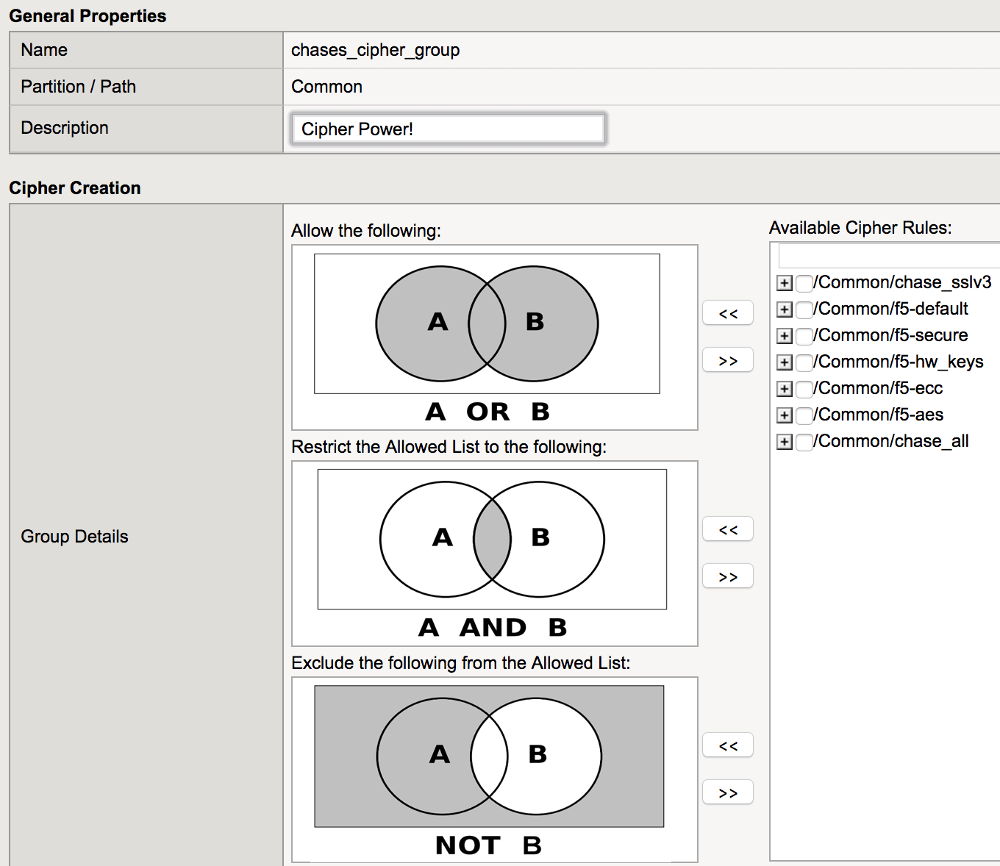

Securing the SSL for the Application
~~~~~~~~~~~~~~~~~~~~~~~~~~~~~~~~~~~~

Starting in v13.0 the allowed SSL Ciphers can be managed with a combination of SSL Cipher Rules and Cipher Groups.  Using a combination of these rules you can create a secure ClientSSL profile that will protect your app and allow the clients necessary.  

SSL Cipher Rules can be combined in the groups as follows:

1. We will start by creating a SSL Cipher Rule.  Click on Local Traffic, Ciphers, Rules, then Create.

2. Enter a name for the rule.

3. Enter the following Cipher String

     !SSLv2:!EXPORT:!DHE+AES-GCM:!DHE+AES:!DHE+3DES:ECDHE+AES-GCM:ECDHE+AES:RSA+AES-GCM:RSA+AES:ECDHE+3DES:RSA+3DES:-MD5:-SSLv3:-RC4

4. Click on Finished.

5. Now click on the Groups Tab.

6. Click on Create.

7. Enter a name for the Cipher Group.

8. Select the rule previously created and add it to the "Allow the Following" category. 

9. Down at the bottom of the Cipher Group configuration will be the allowed Ciphers.  With the above string you will get a security configuration that will still allow some older clients like WindowsXP and IE8.  You can further security it by removed TLSv1 or making it so the default f5-ecc cipher rule is in the "Restrict the Allowed List to the Following."

10. Click on Fkinished.
