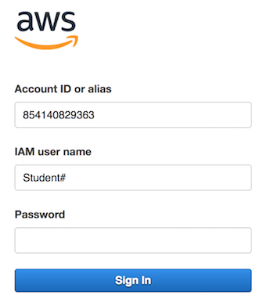

Create AWS VPC and Networking
-----------------------------

The first module is create the AWS VPC and required networking. Module 2 will build upon this deployment.

The following diagram shows a basic multi-NIC deployment of BIG-IP VE in an Amazon Virtual Private Cloud (VPC).

Complete the tasks in this guide to create this deployment.


|
This deployment shows three subnets:

- An external, public subnet, where you'll create a virtual server to accept Internet traffic.
- An internal, private subnet, where your application servers live.
- A management subnet, where you can access the BIG-IP Configuration utility; you use the Configuration utility to configure BIG-IP VE.

Traffic flows from clients through BIG-IP VE to application servers.

You create all IP addresses and network interfaces in AWS. Then in BIG-IP VE, you create corresponding objects for the same IP addresses, represented by the shaded boxes in the diagram.

Environment
-----------
All labs as part of this class will be done through the AWS Management Console. An account has been created for you.
|login|

- Account ID or alias <prepopulated>
- IAM user name <Student#> where # is the number assigned during class
- Password <Given in classroom>



**Important! Ensure all you are in the US East (N. Virginia) region!**

Prepare
-------

To create a multi-NIC configuration, you must first create an Amazon virtual private cloud (VPC). This is the network environment where your instances will reside.

==== =================================================================================== ====================================================================================================================================================================================================================================================
Step Task                                                                                Description
==== =================================================================================== ====================================================================================================================================================================================================================================================
1    :ref:`Create a VPC with multiple subnets <awsmultivpc>`                             Use the VPC wizard to create a management subnet for administrative access, an external subnet for application access, and a NAT instance for network translation.

                                                                                         - Management subnet (called Public in the AWS UI): ``10.0.0.0/24``
                                                                                         - External subnet (called Private in the AWS UI): ``10.0.1.0/24``
                                                                                         - NAT instance and associated network interface.

2    :ref:`Create an internal subnet <awsintsub>`                                        This subnet contains your web servers.

                                                                                         - Internal subnet: ``10.0.2.0/24``

3    :ref:`Add routes so BIG-IP VE can access the Internet <awsroutes>`                  Add the private IP address of the external subnet as the gateway in a route for outbound traffic.


==== =================================================================================== ====================================================================================================================================================================================================================================================

\


.. _awsmultivpc:

Create a VPC with multiple subnets
``````````````````````````````````

A BIG-IP VE instance must be in an Amazon virtual private cloud (VPC). You can use a wizard to create a VPC that has management and external subnets. You will create the internal subnet separately.

1. In the AWS Management Console, from the Services menu at the top of the screen (scroll down), from the VPC Dashboard select :guilabel:`Create VPC`.
2. Click :menuselection:`Start VPC Wizard -> VPC with Public and Private Subnets`, and then click :guilabel:`Select`.
3. Complete the wizard with the following entries.

   The subnet listed as Public in the AWS UI is for management traffic to the BIG-IP Configuration utility. The subnet listed as Private is for application traffic to the BIG-IP VE external VLAN.

   .. figure:: ../images/vpc_multi_subnet.png

   |

4. Leave all other default settings and click :guilabel:`Create VPC`.


Note: As everyone in the class is using a shared account, you can filter objects based on your student name in most of the AWS console screens.


.. _awsintsub:

Create an internal subnet
`````````````````````````


Now create the internal subnet in that same availability zone. The internal subnet corresponds to the BIG-IP internal VLAN.

1. In the AWS Management Console, from the Services menu at the top of the screen, select :guilabel:`VPC`.
2. In the Navigation pane, under Virtual Private Cloud, select :guilabel:`Subnets`. When you used the VPC wizard, you created two subnets: management and external. Note the availability zone for these subnets (for example, us-east-1e).
3. Click :guilabel:`Create Subnet` and populate the appropriate fields.

   =============================== =========================================
   Field	                       Value
   =============================== =========================================
   :guilabel:`Name tag`	           ``Student#-Internal``
   :guilabel:`VPC`	               Student#
   :guilabel:`Availability Zone`   The zone where the other subnets reside
   :guilabel:`CIDR block`	       ``10.0.2.0/24``
   =============================== =========================================

   \

4. Click :guilabel:`Yes, Create`.

Your VPC should now have three subnets.


|


.. _awsroutes:

Add routes so BIG-IP VE can access the Internet
```````````````````````````````````````````````

By default, AWS will not allow traffic from the management and external subnets to leave the VPC. You must add the BIG-IP external self IP address to the routing table for outbound traffic for the VPC.

1. In the AWS Management Console, from the Services menu at the top of the screen, select :guilabel:`VPC`.
2. In the Navigation pane, under Virtual Private Cloud, select :guilabel:`Route Tables`.
3. Select the routing table with one subnet.

   .. figure:: ../images/routes1.png

   |

4. Click the Subnet Associations tab at the bottom of the screen.
5. Click :guilabel:`Edit`.

   .. figure:: ../images/routes2.png

   |

6. Select the check box for the external subnet, ``10.0.1.0/24``.

   .. figure:: ../images/routes3.png

   |

7. Click :guilabel:`Save`.

The management and external subnets are now explicitly associated with the route table.


.. |github| raw:: html

   <a href="https://github.com/F5Networks" target="_blank">https://github.com/F5Networks</a>

.. |awskeypair| raw:: html

   <a href="http://docs.aws.amazon.com/AWSEC2/latest/UserGuide/ec2-key-pairs.html#having-ec2-create-your-key-pair" target="_blank">create one in AWS</a>

.. |login| raw:: html

   <a href="https://854140829363.signin.aws.amazon.com/console" target="_blank">https://854140829363.signin.aws.amazon.com/console</a>

