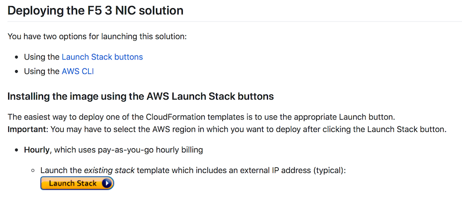

Deploy the BIG-IP
-----------------

In Module 2 we will deploy the BIG-IP into the AWS VPC created in Module 1.

Utilize CFTs from Github
````````````````````````

F5 publishes CFTs on a regular basis to Github.

Navigate to |github| and read through the documentation. Note the ``Prerequisites`` section that describes the requirements for the subnets created in Module 1


|

Launch CFT into existing VPC
````````````````````````````

We'll using the Github CFT to launch a second BIG-IP into the existing VPC that already exists.

First, we need to create and save a key pair.

1. In the AWS Management Console, navigate to :guilabel:`EC2` and then :guilabel:`Key Pairs`
2. Click :guilabel:`Create Key Pair` and name it ``Student#-BIG-IP``.
3. Click :guilabel:`Create` and it will download the ``Student#-BIG-IP.pem`` file to your local machine. Be sure to keep track of this file as you will need it to access the BIG-IP later.

Next, we're ready to deploy the CFT.

1. From the GitHub page, click the :guilabel:`Launch Stack` button about half-way down the page.



2. At the ``Select Template`` page, ensure you are still in the same region where you created your VPC, note the template URL is already selected, and click :guilabel:`Next`.
3. Create a :guilabel:`Stack name` of ``Student#-CFT``
4. Find your ``Student#`` VPC in the drop down.
5. Select the Management, External, and Internal subnets in the drop downs.
6. Change the :guilabel:`BIG-IP Image Name` to ``Good25Mbps``
7. Change the :guilabel:`AWS Instance Size` to ``t2.medium``.
8. Utilize the ``Student#-BIG-IP`` key in the drop down for :guilabel:`SSH Key`
9. Enter the Lab Public IP (this will be given in the classroom) in the :guilabel:`Source Address(es) for Management Access`
10. Enter ``0.0.0.0/0`` in the :guilabel:`Source Address(es) for Web Application Access (80/443)` field.
11. Leave all other fields at default values and select :guilabel:`Next`.
12. Leave all fields in the ``Options`` page at defaults and select :guilabel:`Next`.
13. Review the settings, check the ``I acknowledge that AWS CloudFormation might create IAM resources`` box and click :guilabel:`Create`.
14. Refresh the page to see the status of the deployment.


Set the admin password for BIG-IP VE
````````````````````````````````````
To initially change the password for the BIG-IP management utility we need to connect via SSH and then modify the admin password.

1.  First, you will need to change the permissions of the ``Student#-BIG-IP.pem`` key pair you saved above. For example, ``chmod 400 Student#-BIG-IP.pem``
2.  Next, find the EIP that the CFT created for the ``Management`` interface of your BIG-IP instance by going to :guilabel:`EC2 -> Network Interfaces` and filtering for ``Student#``. Note the IP address for the ``Management`` interface.
3.  You can connect using an SSH utility - make sure to use ``admin`` as the username (do not use ``root``) and the ``Management EIP`` from the previous step. Use the ``Student#-BIG-IP.pem`` key pair you saved when you created the instance in Lab 1. For example: ``ssh -i Student#.pem admin@<EIP-of-Management>``
4.  After connecting via SSH issue the command ``modify auth password admin`` - change the admin password to one that you will remember
5.  Save the password change by issuing the command ``save sys config``
6.  You can now connect to the BIG-IP Web UI on HTTPS using the EIP for the management interface (bypass the self-signed cert warning) and the credentials admin/<password-from-step-4>


.. |github| raw:: html

   <a href="https://github.com/F5Networks/f5-aws-cloudformation/tree/master/supported/standalone/3nic/existing-stack/payg" target="_blank">F5's Github repository</a>